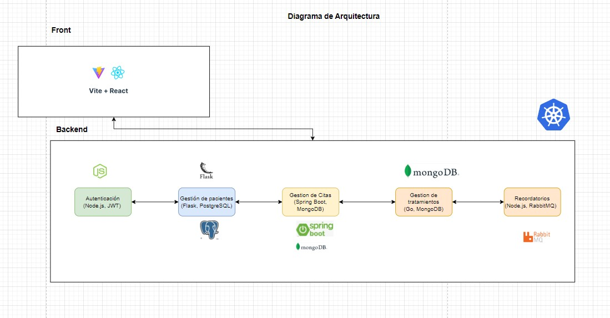
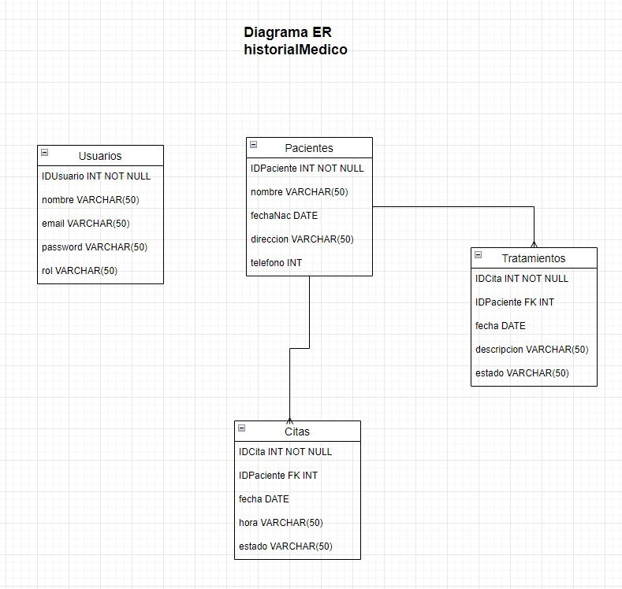

### Proyecto: Plataforma de Gestión para una Clínica Dental

#### Descripción General
Una plataforma de gestión para una clínica dental que permita la administración de citas, gestión de pacientes, control de inventarios, gestión de tratamientos y envío de recordatorios a los pacientes.

### Arquitectura de Microservicios

#### Tecnologías Consideradas

**Frontend**
- **React con Vite**: Para construir al interfaz de usuario y Vite es un bundler rápido y eficiente para proyectos de frontend.

**Backend**
- **Node.js con Express.js**: Para el servicio de autenticación y el servicio de recordatorios.
- **Flask (Python)**: Para el servicio de gestión de pacientes.
- **Java Spring Boot**: Para el servicio de gestión de citas.
- **Go**: Para el servicio de gestión de tratamientos.

**Infraestructura y Despliegue**
- **Contenedores**: Docker.
- **Orquestación**: Kubernetes.
- **Infraestructura como Código**: Terraform, Ansible.
- **Cloud**: AWS (puede adaptarse a otras opciones como Azure o Google Cloud).
- **CI/CD**: Jenkins, GitHub Actions.

**Monitoreo y Logging**
- **Monitoreo**: Prometheus, Grafana.

### Diagrama de Arquitectura

### Diseño de Microservicios

**Servicio de Autenticación**
- **Tecnologías**: Node.js, Express.js, JWT.
- **Endpoints**:
  - POST `/register`: Registro de usuario.
  - POST `/login`: Inicio de sesión.
  - GET `/profile`: Obtención de perfil de usuario.

**Servicio de Gestión de Pacientes**
- **Tecnologías**: Flask, PostgreSQL.
- **Endpoints**:
  - GET `/patients`: Listado de pacientes.
  - POST `/patients`: Registro de paciente.
  - PUT `/patients/:id`: Actualización de datos de paciente.
  - GET `/patients/:id/medical-history`: Historial médico del paciente.

**Servicio de Gestión de Citas**
- **Tecnologías**: Java Spring Boot, MongoDB.
- **Endpoints**:
  - POST `/appointments`: Programación de cita.
  - GET `/appointments`: Listado de citas.
  - PUT `/appointments/:id`: Actualización de cita.
  - DELETE `/appointments/:id`: Cancelación de cita.

**Servicio de Gestión de Tratamientos**
- **Tecnologías**: Go, MongoDB.
- **Endpoints**:
  - POST `/treatments`: Registro de tratamiento.
  - GET `/treatments`: Listado de tratamientos.
  - PUT `/treatments/:id`: Actualización de tratamiento.
  - GET `/treatments/:patientId`: Historial de tratamientos por paciente.

**Servicio de Recordatorios**
- **Tecnologías**: Node.js, RabbitMQ.
- **Endpoints**:
  - POST `/reminders`: Envío de recordatorio.
  - GET `/reminders`: Listado de recordatorios.

### Diagrama ER (Entidad-Relación)

### Implementación

#### Frontend
- **Tecnologías**: React con Vite.

#### Backend
- **Servicio de Autenticación**: Node.js, Express.js, JWT.
- **Servicio de Gestión de Pacientes**: Flask, PostgreSQL.
- **Servicio de Gestión de Citas**: Java Spring Boot, MongoDB.
- **Servicio de Gestión de Tratamientos**: Go, MongoDB.
- **Servicio de Recordatorios**: Node.js, RabbitMQ.

#### Infraestructura y Despliegue
- **Contenedores**: Docker.
- **Orquestación**: Kubernetes.
- **Infraestructura como Código**: Terraform, Ansible.
- **Cloud**: AWS (puede adaptarse a otras opciones como Azure o Google Cloud).
- **CI/CD**: Jenkins, GitHub Actions.

#### Monitoreo y Logging
- **Monitoreo**: Prometheus, Grafana.
- **Logging**: ELK Stack (Elasticsearch, Logstash, Kibana).

### Desarrollo y Pruebas

#### Control de Versiones
- **Tecnologías**: Git, GitHub.

Gestión para una clínica dental basado en microservicios utilizando tecnologías accesibles y comunes, con una arquitectura escalable y bien documentada.